# EAT Agent Workbench — 系统使用说明

> 版本 0.1.0 | 最后更新 2026-03-23

## 目录

- [系统概述](#系统概述)
- [快速开始](#快速开始)
- [完整操作流程](#完整操作流程)
  - [第一步：注册项目](#第一步注册项目)
  - [第二步：创建任务](#第二步创建任务)
  - [第三步：工作区操作](#第三步工作区操作)
  - [第四步：需求澄清](#第四步需求澄清)
  - [第五步：计划审阅与批准](#第五步计划审阅与批准)
  - [第六步：执行监控](#第六步执行监控)
  - [第七步：成品预览与验收](#第七步成品预览与验收)
- [界面详解](#界面详解)
  - [控制台（Dashboard）](#控制台dashboard)
  - [任务创建](#任务创建)
  - [工作区（Workspace）](#工作区workspace)
  - [计划审阅](#计划审阅)
  - [运行看板](#运行看板)
  - [指标（Metrics）](#指标metrics)
- [常见问题](#常见问题)
- [API 参考](#api-参考)

---

## 系统概述

**EAT Agent Workbench** 是一个基于 Web 的 AI Agent 编排工作台。它允许用户：

- 注册 Git 仓库作为项目
- 创建编程任务并描述需求
- 与 Lead Agent 进行需求澄清对话
- 审阅和批准 Agent 生成的执行计划
- 监控多个 Worker Agent 并行执行
- 在浏览器内预览最终成品

### 任务生命周期

```
创建 (DRAFT)
  → 需求澄清 (CLARIFYING)
    → 方案规划 (PLANNING)
      → 计划审阅 (PLAN_REVIEW)
        → 批准执行 (EXECUTING)
          → 代码审查 (REVIEWING)
            → 分支合并 (MERGING)
              → 完成 (COMPLETED)
```

### 系统架构

| 组件 | 说明 |
|------|------|
| Web UI | 单页应用，毛玻璃效果设计 |
| API Server | Go HTTP 服务器 |
| SQLite | 任务和项目数据存储 |
| Agent Runtime | Lead + Worker Agent 会话管理 |
| Git Integration | 分支、Worktree 隔离执行 |

---

## 快速开始

### 1. 启动服务器

```bash
cd /path/to/EAT
npm start
```

服务器默认监听 `http://127.0.0.1:3000`。如需回滚到旧 Node 实现，可使用 `npm run start:node`。

### 2. 打开浏览器

访问 `http://localhost:3000`，你会看到控制台首页：

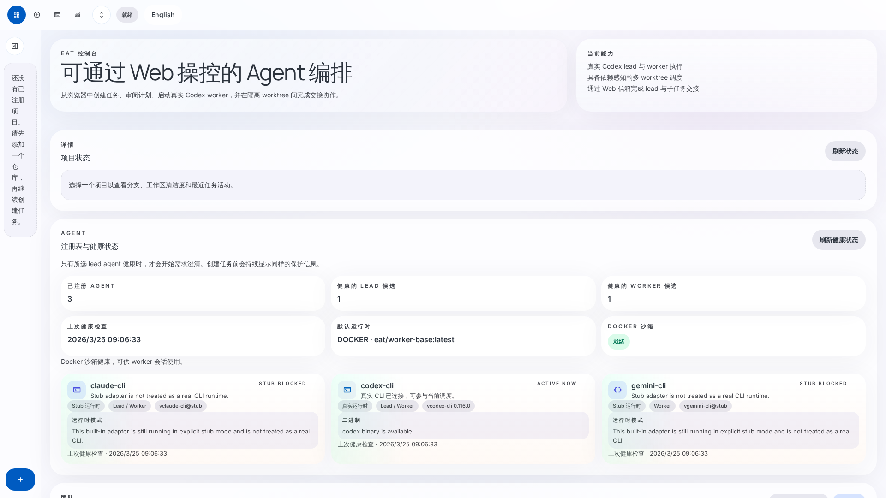

### 3. 快速流程

1. **注册项目** — 点击侧边栏「注册项目」按钮
2. **创建任务** — 切换到「任务创建」标签页
3. **进入工作区** — 在工作区中与 Leader 对话
4. **审阅计划** — Leader 生成计划后进行审阅
5. **监控执行** — 在运行看板查看进度

---

## 完整操作流程

### 第一步：注册项目

项目是 EAT 系统的基础单元。每个项目对应一个 Git 仓库。

#### 操作步骤

1. 点击左侧边栏底部的「+ 注册项目」按钮
2. 在弹出的对话框中有两种方式选择项目：
   - **浏览文件树**：通过系统目录树导航到仓库位置
   - **直接输入路径**：在右侧面板输入仓库绝对路径

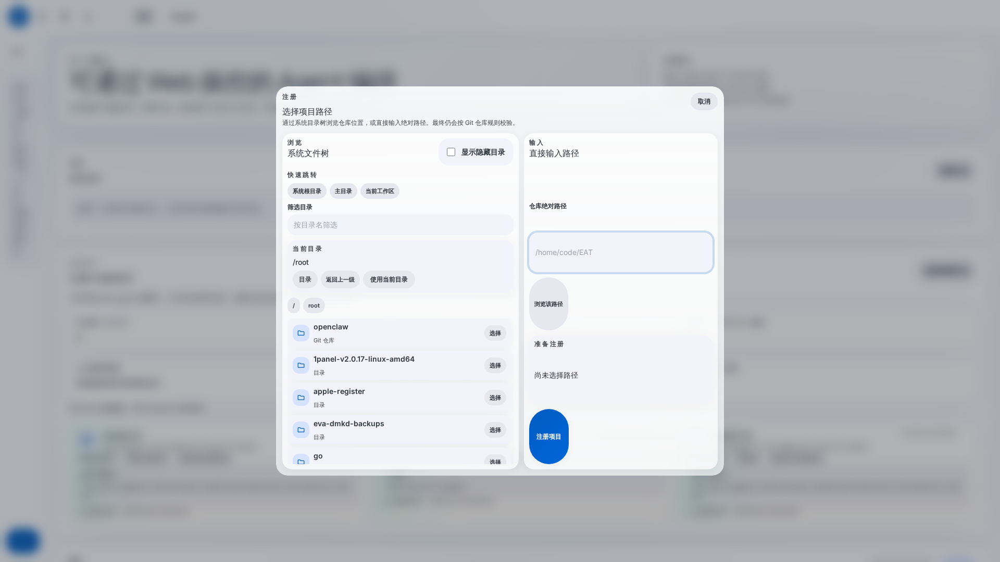

3. 输入项目路径后，点击「注册项目」按钮

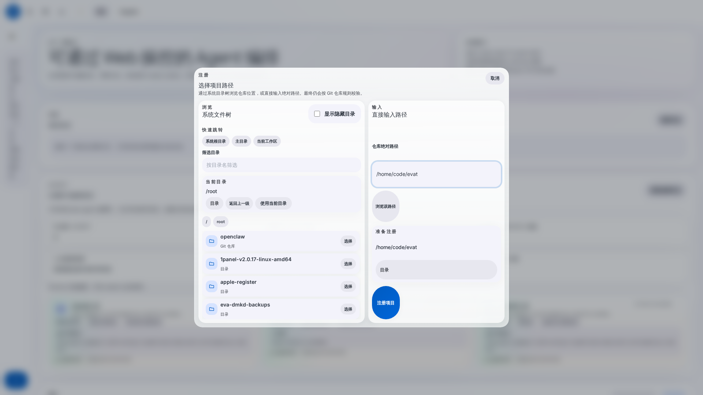

4. 注册成功后，项目会出现在左侧边栏

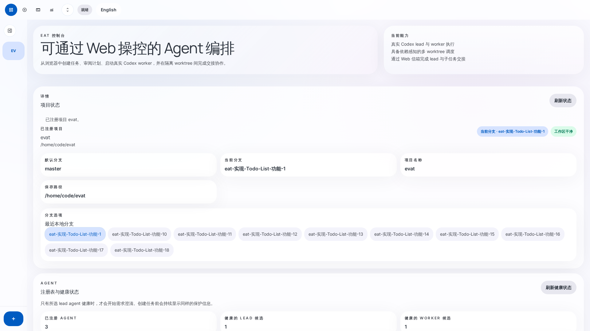

#### 注意事项

- 路径必须是一个有效的 Git 仓库
- 同一仓库不能重复注册（即使使用符号链接）
- 路径不存在时会提示错误

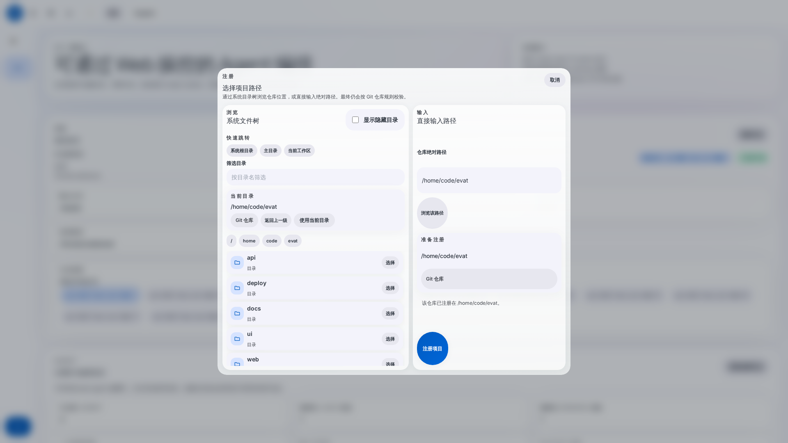

---

### 第二步：创建任务

#### 操作步骤

1. **选择项目**：点击侧边栏中的项目名称

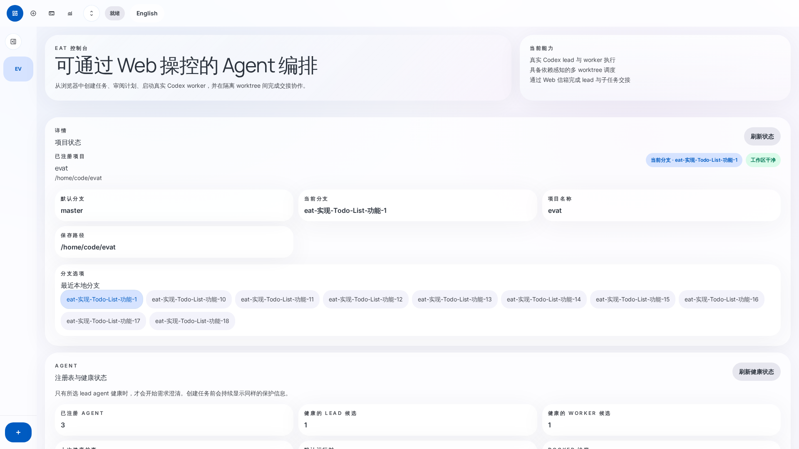

2. **切换到任务创建视图**：点击顶部导航的「任务创建」标签

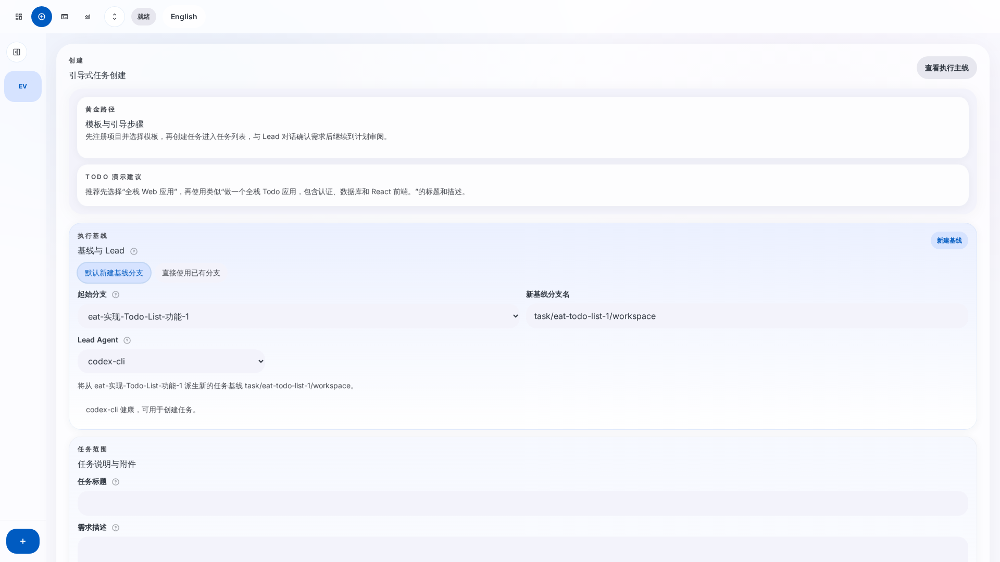

3. **配置执行基线**：
   - **分支模式**：选择「新建基线分支」或「使用已有分支」
   - **起始分支**：选择从哪个分支创建新基线
   - **新基线分支名**：如 `task/todo-list`
   - **Lead Agent**：选择编排 Agent（如 `codex-cli`）

4. **填写任务信息**：
   - **任务标题**：简洁描述任务目标
   - **需求描述**：详细的需求、技术要求和验收标准

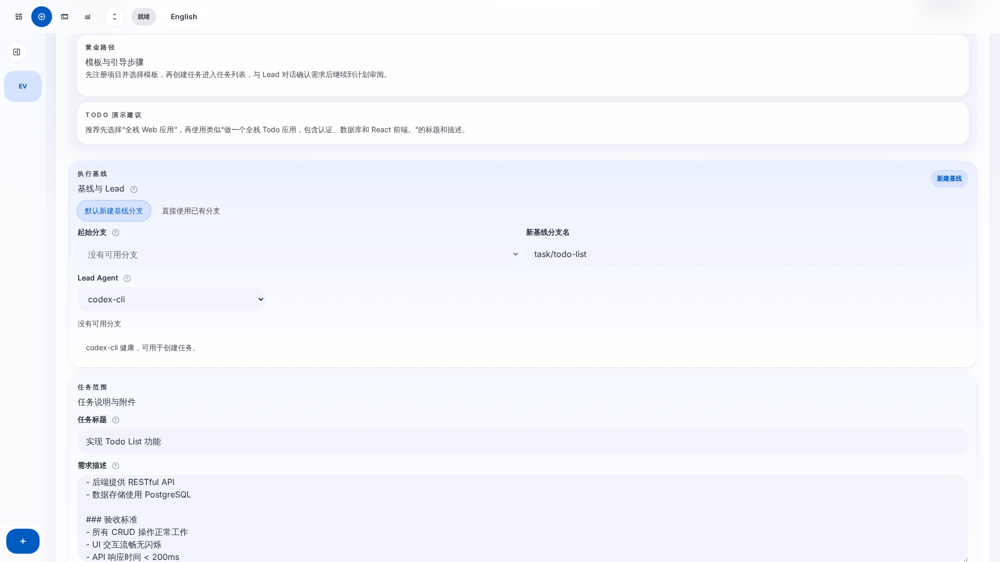

5. 点击「创建任务」按钮提交

#### 示例：Todo List 任务

```
标题：实现 Todo List 功能

描述：
## 需求描述
为 evat 项目实现一个完整的 Todo List 功能模块。

### 功能要求
1. 用户可以添加新的待办事项
2. 用户可以标记待办事项为已完成
3. 用户可以删除待办事项
4. 待办列表需要持久化存储
5. 支持按状态筛选（全部/未完成/已完成）

### 技术要求
- 前端使用现有的 UI 框架
- 后端提供 RESTful API
- 数据存储使用 PostgreSQL

### 验收标准
- 所有 CRUD 操作正常工作
- UI 交互流畅无闪烁
- API 响应时间 < 200ms
```

#### 引导式创建（可选）

系统提供预设模板快速创建任务：
- **全栈 Web 应用** — 6 个角色（架构师、后端、数据库、前端、测试、集成）
- **后端 API** — 5 个角色
- 其他模板...

选择模板后，任务会直接进入计划审阅状态，跳过澄清环节。

---

### 第三步：工作区操作

任务创建后，切换到「工作区」标签。这是日常操作的核心界面。


#### 工作区布局

工作区采用**聚焦 + 上下文**的双栏布局：

| 区域 | 说明 |
|------|------|
| **左侧 — Leader 对话** | 与 Lead Agent 的实时聊天窗口 |
| **右上 — 紧凑头栏** | 任务标题、状态徽章、阶段圆点、主操作按钮 |
| **右中 — 标签栏** | 四个上下文标签页 |
| **右下 — 标签内容** | 当前选中标签的详细内容 |

#### 四个标签页

| 标签 | 内容 | 何时重点关注 |
|------|------|------------|
| **概览** | 任务描述、下一步摘要、决策卡片、验收就绪度 | 查看全局状态 |
| **文档** | 任务文档章节（澄清过程中自动生成） | 澄清阶段 |
| **方案** | Leader 生成的执行方案预览 | 规划和审阅阶段 |
| **团队** | 执行态势、Lead/Worker 状态、成员列表 | 执行阶段 |

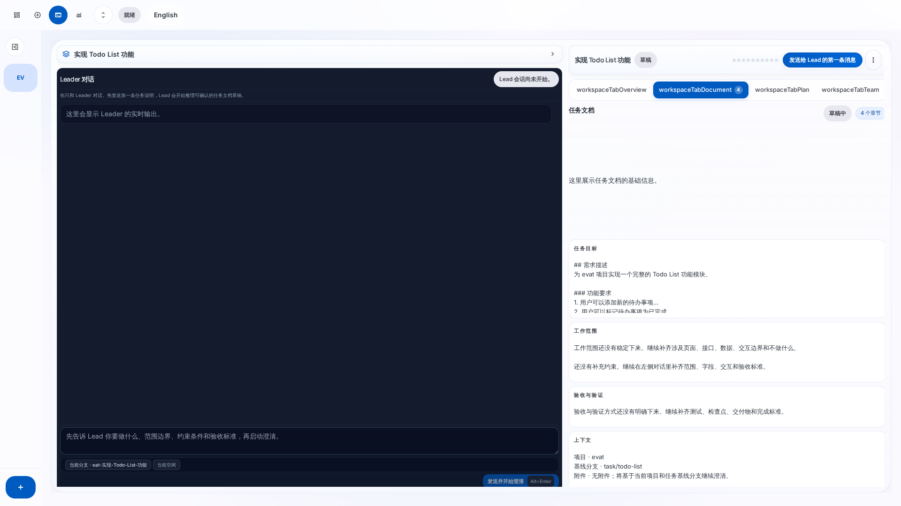

#### 智能标签选择

系统会根据任务当前阶段自动选中最相关的标签：
- DRAFT / CLARIFYING → **文档**标签
- PLANNING / PLAN_REVIEW → **方案**标签
- EXECUTING / REVIEWING / MERGING → **团队**标签
- COMPLETED → **概览**标签

#### 溢出菜单

点击头栏右侧的 `⋮` 按钮，可以访问：
- 暂停任务
- 删除任务
- 刷新任务
- 成品预览
- 分支、项目、Lead、会话等元信息

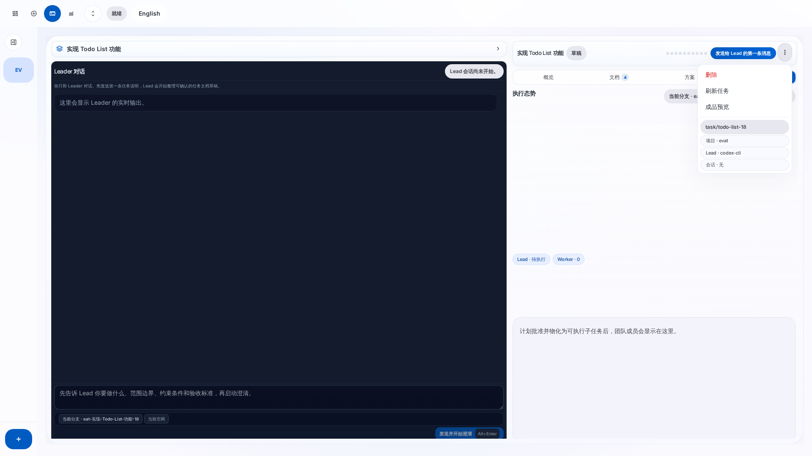

#### 任务切换

点击左侧顶部的任务切换器（带 `>` 箭头的按钮），可以在弹出的对话框中搜索和切换不同任务。

---

### 第四步：需求澄清

1. 在工作区中，点击头栏的**主操作按钮**（如「发送给 Lead 的第一条消息」）
2. 在左侧聊天面板的输入框中输入需求补充
3. 点击「发送」或按 `Alt+Enter` 发送消息
4. Lead Agent 会回复澄清问题
5. 持续对话直到需求明确

#### 确认文档

当需求足够明确时：
1. 查看右侧**文档**标签页中的任务文档
2. 确认文档内容完整
3. 点击聊天区底部的「已确认任务文档」按钮
4. 系统进入规划阶段

---

### 第五步：计划审阅与批准

Leader 生成执行计划后，任务进入 `PLAN_REVIEW` 状态。

1. 切换到**方案**标签页查看 Leader 的分配方案
2. 或切换到独立的「计划审阅」视图进行详细编辑


#### 计划编辑功能

- **图谱视图** — 可视化依赖关系
- **列表视图** — 表格编辑子任务
- **添加子任务** — 手动添加执行单元
- **应用模板** — 使用预设模板重置计划
- **保存草稿** — 保存编辑但不批准
- **批准草稿** — 锁定计划并开始执行

---

### 第六步：执行监控

计划批准后，Worker Agent 开始并行执行各子任务。

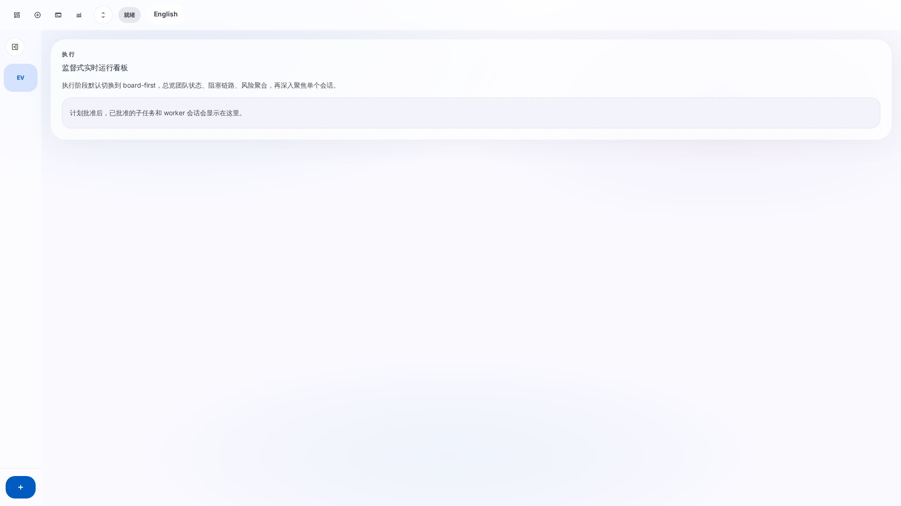

#### 监控工具

- **工作区团队标签** — 查看 Lead/Worker 状态
- **运行看板** — 详细的任务进度面板
  - 看板视图 — 按状态分列显示子任务
  - 图谱视图 — 可视化依赖关系
  - 活动流 — 实时事件日志
- **信箱系统** — Agent 之间的交接消息

#### 子任务状态

| 状态 | 说明 |
|------|------|
| PENDING | 等待启动 |
| BLOCKED | 等待依赖完成 |
| READY | 就绪可执行 |
| RUNNING | 正在执行 |
| REVIEW_PENDING | 等待审查 |
| ACCEPTED | 审查通过 |
| MERGED | 已合并 |

---

### 第七步：成品预览与验收

当所有子任务完成或接近完成时，可以启动成品预览。

1. 点击溢出菜单中的「成品预览」，或使用主操作按钮
2. 在全屏弹层中配置预览参数：
   - **预览目标** — 选择要预览的分支
   - **应用根目录** — 选择应用入口
   - **启动命令** — 自动检测或手动输入
   - **端口** — 应用监听端口
   - **预览路径** — 访问路径

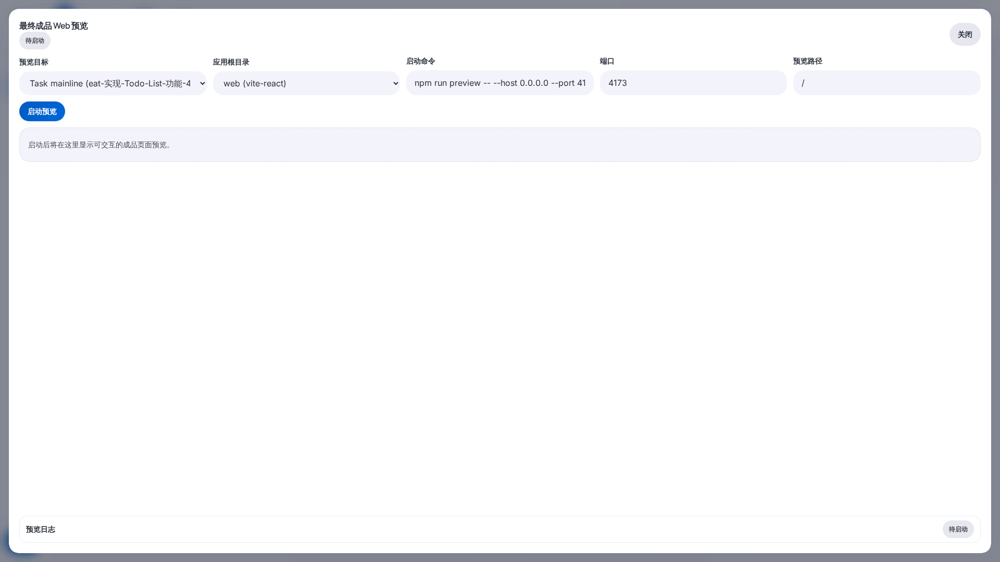

3. 点击「启动预览」
4. 在 iframe 中直接查看成品效果
5. 确认无误后完成任务

---

## 界面详解

### 控制台（Dashboard）

首页展示系统概览信息：

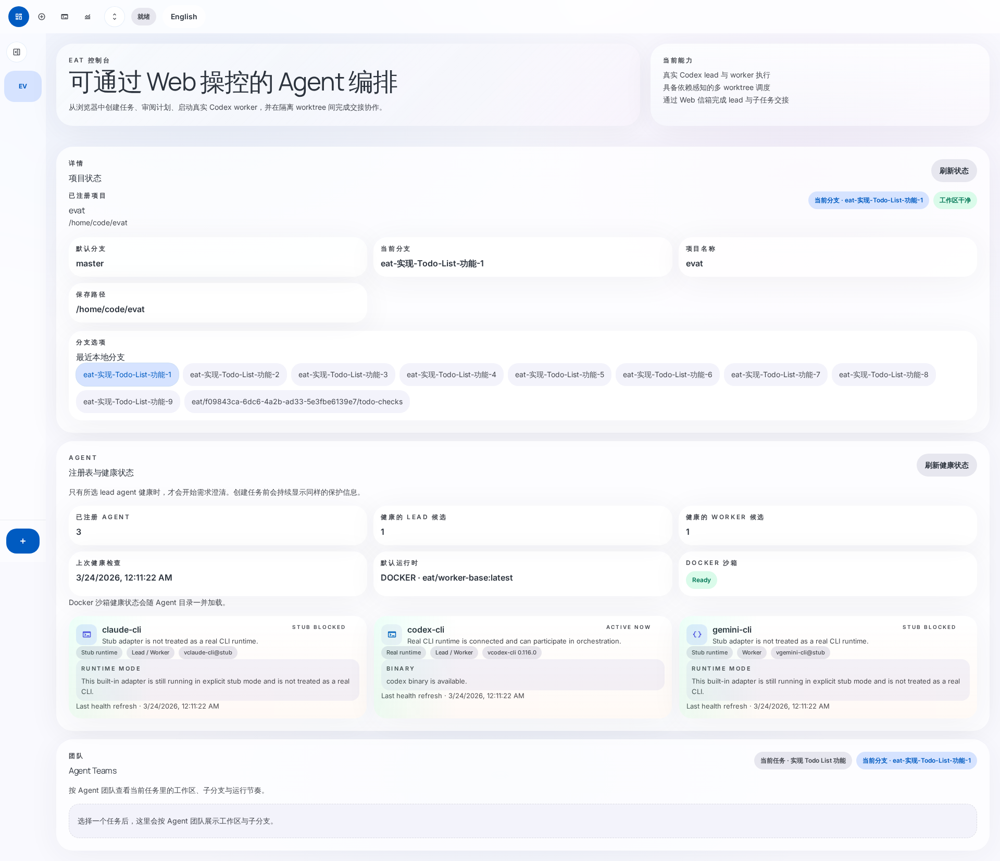

- **项目状态** — 当前分支、清洁度、分支列表
- **Agent 健康** — 各 Agent 运行状态和可用性
- **Agent Teams** — 当前活跃的编排团队

### 任务创建

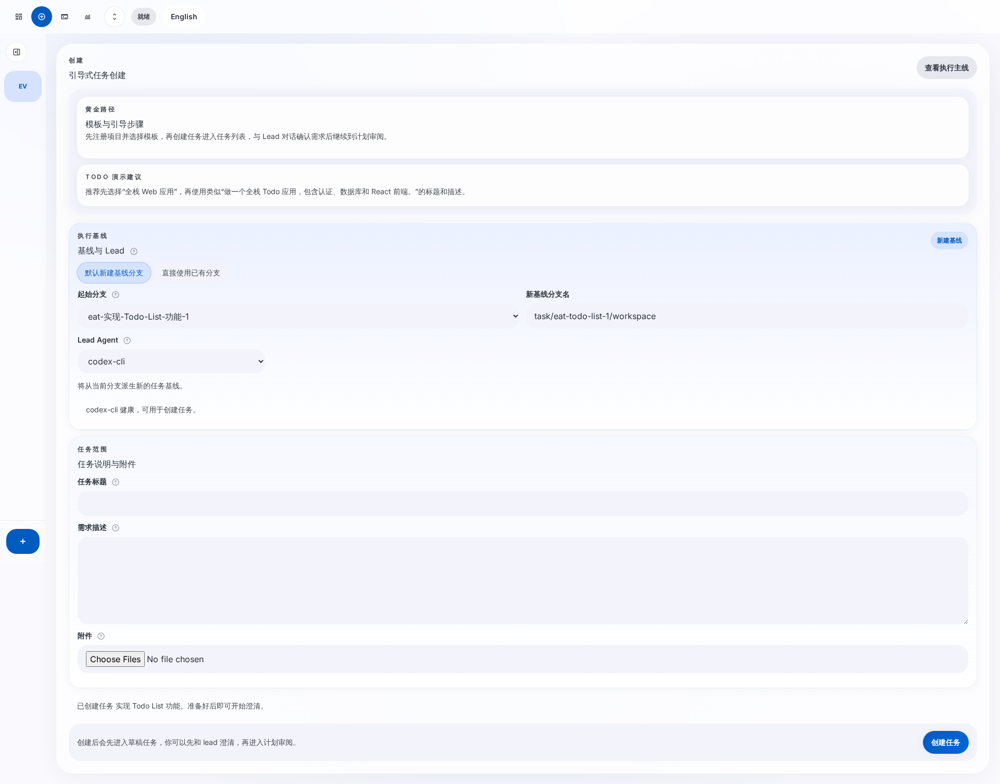

- **执行基线** — 分支配置和 Lead Agent 选择
- **任务范围** — 标题、描述和附件
- **模板引导** — 快速创建预设任务

### 工作区（Workspace）

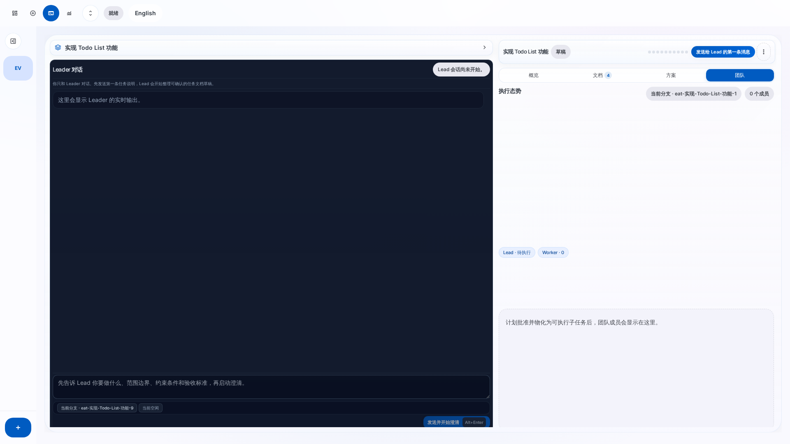

核心工作界面，包含：
- 左侧 Leader 对话
- 右侧紧凑头栏 + 标签式上下文面板
- 阶段圆点显示当前进度

### 计划审阅

独立的计划编辑视图，支持：
- DAG 图谱可视化
- 子任务详细编辑
- 模板应用和快照恢复

### 运行看板

实时执行监控面板，支持：
- 看板/图谱/活动流多种视图
- 子任务操作（重试、取消、重新分配）
- 信箱系统查看 Agent 交接消息

### 指标（Metrics）

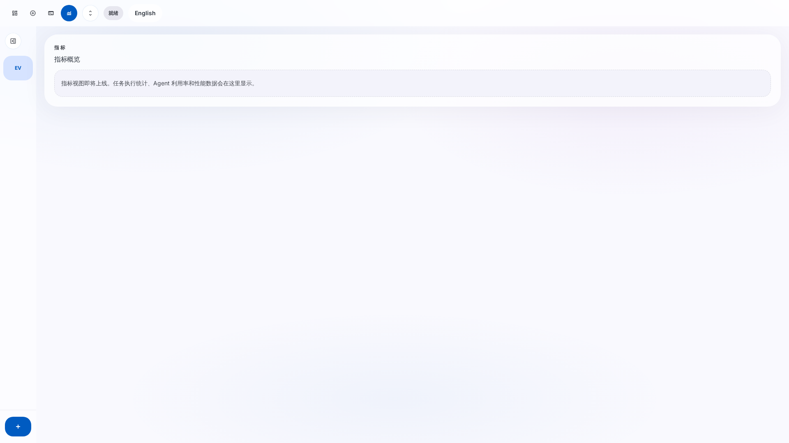

任务执行统计和性能指标。

---

## 常见问题

### Q: 注册项目时提示「该仓库已注册」？

A: 同一个 Git 仓库只能注册一次。如果需要重新注册，先在侧边栏删除该项目。

### Q: 创建任务时提示「Lead agent must be a registered orchestrator」？

A: 需要确保系统中有可用的 Agent。检查 Agent 健康状态：
- 在控制台页面查看「Agent 健康状态」区域
- 或通过 API: `GET /api/agents/health`

### Q: 任务卡在某个状态不动？

A: 可以尝试：
1. 点击溢出菜单的「刷新任务」
2. 查看聊天面板中的 Lead 输出
3. 如果 Agent 会话已结束，可以通过发送消息重启

### Q: 如何删除任务？

A:
1. 打开溢出菜单 `⋮`
2. 先「暂停任务」
3. 然后「删除任务」
4. 确认对话框中可选择是否同时删除 Git 分支

### Q: 预览启动失败？

A: 检查：
- 应用根目录是否正确（系统会自动检测）
- 端口是否被占用
- 启动命令是否正确

### Q: 如何切换语言？

A: 点击顶部导航右侧的「English / 中文」按钮即可切换。

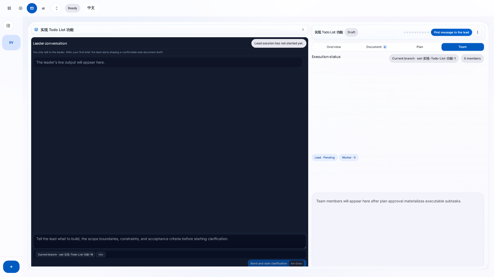

---

## API 参考

### 项目管理

| 方法 | 路径 | 说明 |
|------|------|------|
| POST | `/api/projects` | 注册项目 |
| GET | `/api/projects` | 获取项目列表 |
| GET | `/api/projects/:id` | 获取项目详情 |
| DELETE | `/api/projects/:id` | 删除项目 |
| GET | `/api/projects/:id/repo-status` | 获取仓库状态 |
| GET | `/api/projects/browse` | 浏览目录 |

### 任务管理

| 方法 | 路径 | 说明 |
|------|------|------|
| POST | `/api/tasks` | 创建任务 |
| POST | `/api/guided-tasks` | 引导式创建任务 |
| GET | `/api/tasks/:id` | 获取任务详情 |
| DELETE | `/api/tasks/:id` | 删除任务 |
| POST | `/api/tasks/:id/start-clarification` | 开始澄清 |
| POST | `/api/tasks/:id/messages` | 发送消息 |
| POST | `/api/tasks/:id/confirm-requirements` | 确认需求 |
| PUT | `/api/tasks/:id/current-plan` | 更新计划 |
| POST | `/api/tasks/:id/approve-plan` | 批准计划 |
| POST | `/api/tasks/:id/pause` | 暂停任务 |
| POST | `/api/tasks/:id/resume` | 恢复任务 |
| POST | `/api/tasks/:id/archive` | 归档任务 |

### 执行监控

| 方法 | 路径 | 说明 |
|------|------|------|
| GET | `/api/tasks/:id/board` | 获取看板数据 |
| GET | `/api/tasks/:id/team` | 获取团队数据 |
| GET | `/api/tasks/:id/events` | SSE 实时事件流 |
| POST | `/api/tasks/:id/mailbox` | 发送信箱消息 |

### 预览管理

| 方法 | 路径 | 说明 |
|------|------|------|
| GET | `/api/tasks/:id/preview` | 获取预览状态 |
| POST | `/api/tasks/:id/preview/start` | 启动预览 |
| POST | `/api/tasks/:id/preview/stop` | 停止预览 |

### 系统

| 方法 | 路径 | 说明 |
|------|------|------|
| GET | `/api/agents` | Agent 目录 |
| GET | `/api/agents/health` | Agent 健康状态 |
| GET | `/api/task-templates` | 任务模板列表 |
| GET | `/api/metrics/summary` | 指标摘要 |

---

*本文档基于 E2E 自动化测试结果自动生成，配图均为 Playwright 浏览器截图。*
