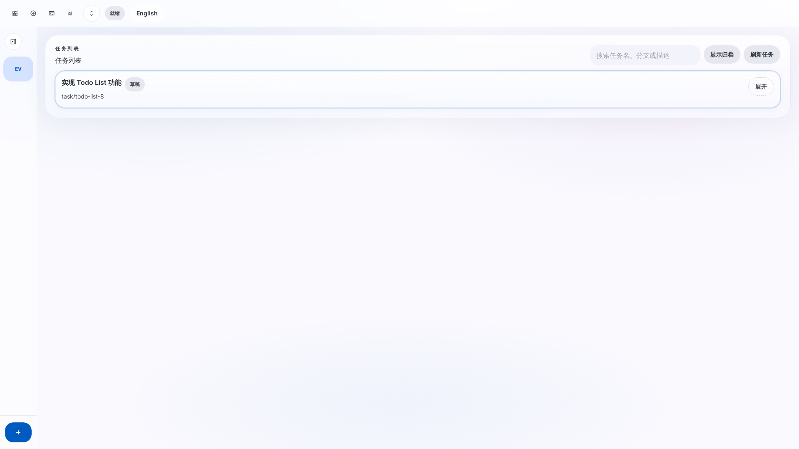
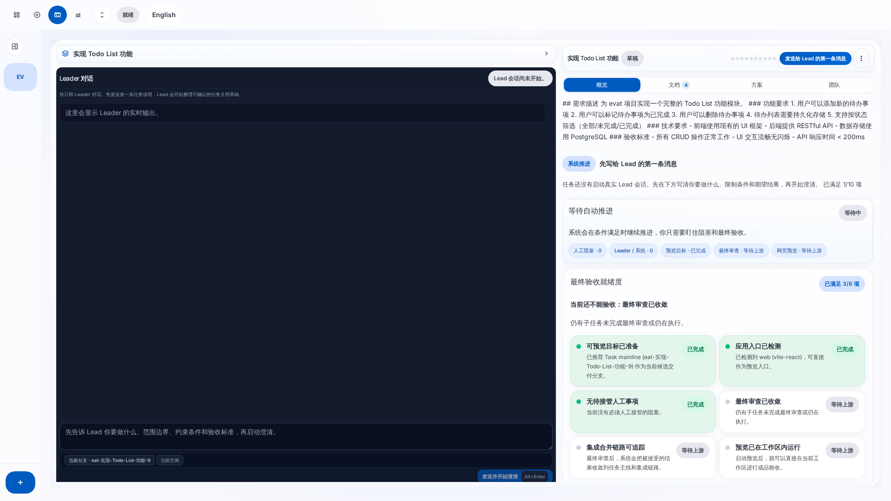
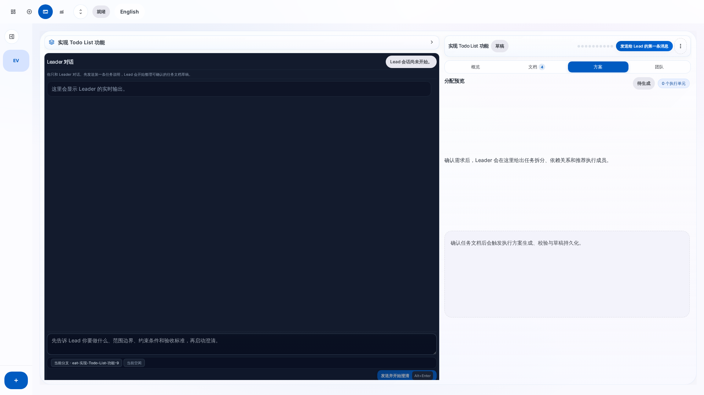
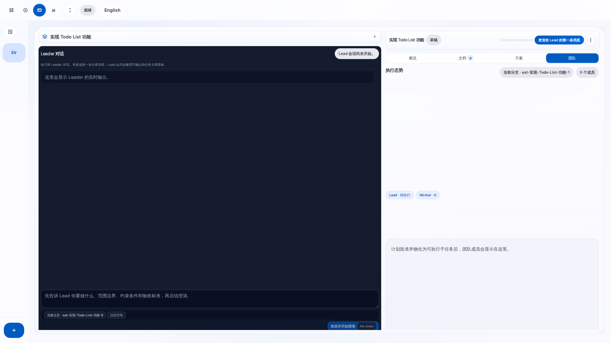
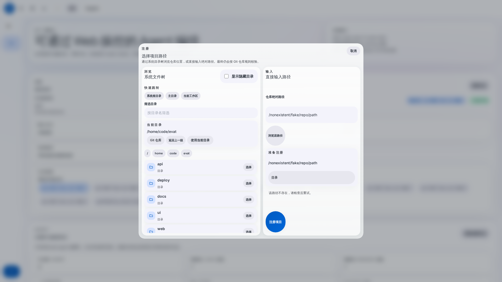
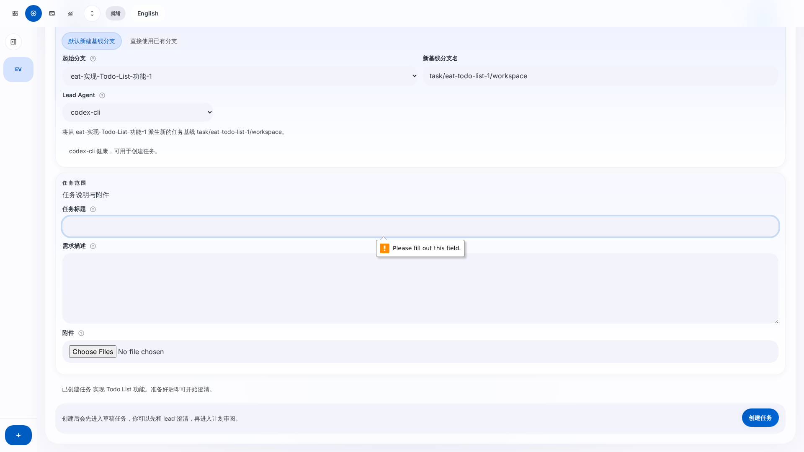
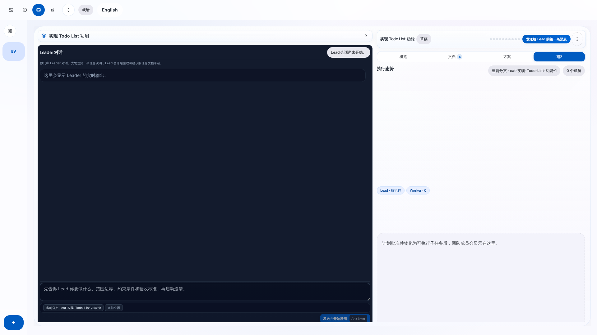
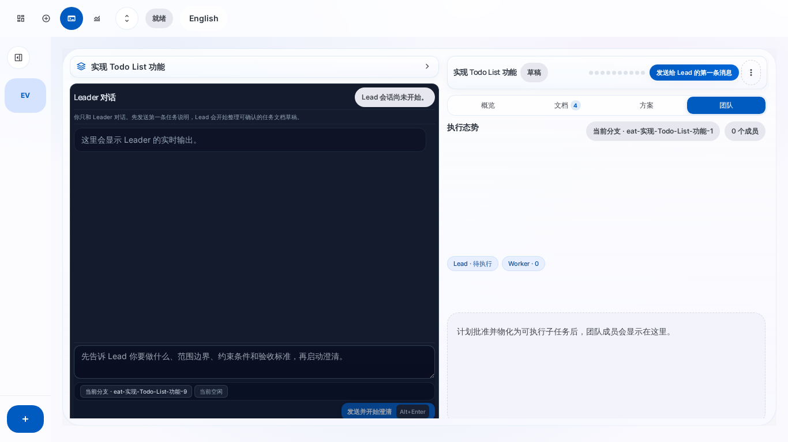
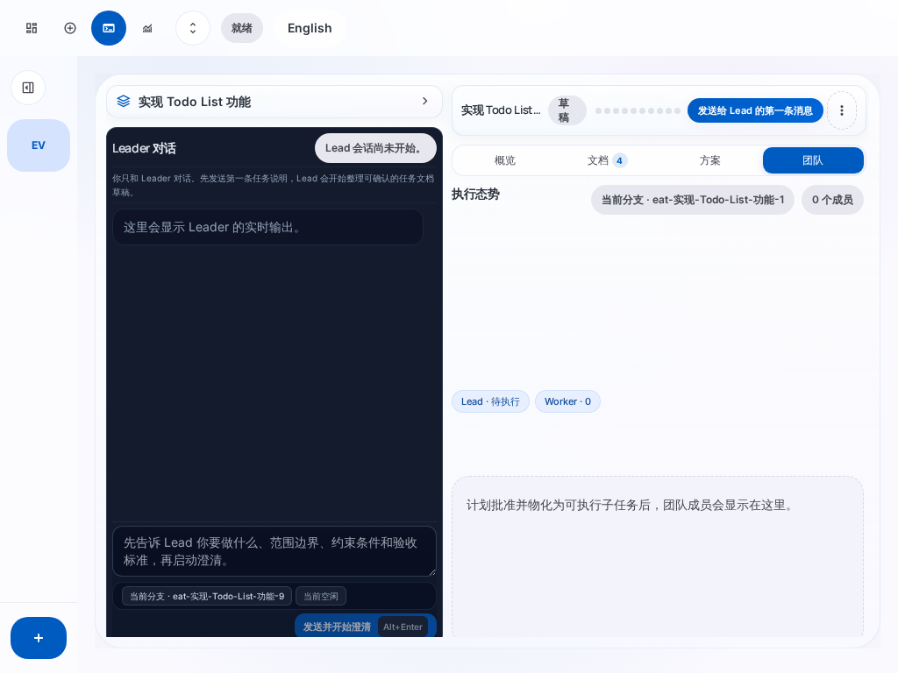

# EAT Agent Workbench — E2E 测试报告

> 自动生成于 2026-03-23T16:11:29.644Z

## 测试环境

| 项目 | 值 |
|------|----|
| 系统 | Linux 6.8.0-101-generic |
| Node.js | v22.22.0 |
| 浏览器 | Chromium (Playwright Headless) |
| 视口 | 1920×1080 (默认) |
| 目标项目 | /home/code/evat |
| 总耗时 | 37.9s |

## 测试结果摘要

| 状态 | 数量 |
|------|------|
| ✅ 通过 | 22 |
| ⚠️ 警告 | 1 |
| ⏭️ 跳过 | 2 |
| ❌ 失败 | 0 |
| **合计** | **25** |

## 详细测试结果

| # | 测试名称 | 状态 | 详情 | 耗时 |
|---|----------|------|------|------|
| 1 | 首页加载 | ✅ PASS | 标题: EAT Agent Workbench, 导航标签: 7 个 | 2.4s |
| 2 | 注册 evat 项目 | ✅ PASS | 项目名: EV
        
          evat
          /home/code/evat | 5.0s |
| 3 | 选择项目仪表盘 | ✅ PASS | 默认分支: master | 6.0s |
| 4 | 任务创建视图 | ✅ PASS | 表单已渲染 | 6.7s |
| 5 | 创建 Todo List 任务 | ✅ PASS | 反馈: 已创建任务 实现 Todo List 功能。准备好后即可开始澄清。 | 9.0s |
| 6 | 工作区布局验证 | ✅ PASS | 紧凑头栏 ✓, 标签栏 ✓, 聊天面板 ✓ | 11.8s |
| 7 | 标签页切换 | ✅ PASS | overview: ✓, document: ✓, plan: ✓, team: ✓ | 13.8s |
| 8 | 溢出菜单 | ✅ PASS | 菜单项: 删除, 刷新; 点击外部关闭: ✓ | 14.6s |
| 9 | 预览弹层 | ✅ PASS | 表单元素: 预览目标选择器, 启动命令输入, 端口输入 | 16.2s |
| 10 | 重复注册项目 | ✅ PASS | 反馈: 该仓库已注册在 /home/code/evat。 | 18.9s |
| 11 | 无效路径注册 | ✅ PASS | 错误提示: 该路径不存在，请检查后重试。 | 21.4s |
| 12 | 空表单提交 | ✅ PASS | HTML5 表单验证阻止提交 | 23.6s |
| 13 | 工作区空状态 | ✅ PASS | 已有任务选中 | 24.6s |
| 14 | 多视图导航 | ✅ PASS | 控制台: ✓, 任务创建: ✓, 工作区: ✓, 指标: ✓ | 26.8s |
| 15 | 侧边栏折叠 | ✅ PASS | 折叠状态切换: ✓ | 27.7s |
| 16 | 顶部导航折叠 | ✅ PASS | 导航折叠切换: ✓ | 28.5s |
| 17 | API 创建任务 | ⚠️ WARN | HTTP 400: {"code":"LEAD_AGENT_INVALID","message":"Lead agent must be a registered orchestrator.","details":{"leadAgentTy | 28.6s |
| 18 | 紧凑头栏验证 | ⏭️ SKIP | 无任务选中 | 28.6s |
| 19 | 聊天面板 | ⏭️ SKIP | 聊天面板不可见 | 28.6s |
| 20 | 响应式布局 | ✅ PASS | desktop 1920x1080, laptop 1366x768, tablet 1024x768 | 30.7s |
| 21 | 语言切换 | ✅ PASS | 切换前: English → 切换后: 中文 | 32.1s |
| 22 | 计划审阅视图 | ✅ PASS | 视图已加载 | 33.1s |
| 23 | 运行看板视图 | ✅ PASS | 视图已加载 | 34.1s |
| 24 | 指标视图 | ✅ PASS | 视图已加载 | 35.2s |
| 25 | 完整页面截图 | ✅ PASS | 仪表盘 + 任务创建 + 工作区 | 37.9s |

## 测试截图

以下截图记录了测试过程中每个关键步骤的页面状态。

### 首页 — 控制台初始状态

### 项目注册 — 对话框打开

### 项目注册 — 输入项目路径

### 项目注册 — 注册成功，侧边栏显示项目

### 仪表盘 — 选择项目后显示详情

### 任务创建 — 表单视图

### 任务创建 — 填写 Todo List 任务

### 任务创建 — 提交后跳转

### 工作区 — 重设计后的布局

### 工作区 — 文档标签页

### 工作区 — 概览标签页

### 工作区 — 方案标签页

### 工作区 — 团队标签页

### 工作区 — 溢出菜单

### 预览工作室 — 全屏弹层

### 错误处理 — 重复注册项目

### 错误处理 — 无效路径注册

### 错误处理 — 空表单提交

### 响应式 — 桌面 1920×1080

### 响应式 — 笔记本 1366×768

### 响应式 — 平板 1024×768

### 语言切换 — English 模式

### 计划审阅视图

### 运行看板视图

### 指标视图

### 完整截图 — 仪表盘

### 完整截图 — 任务创建

### 完整截图 — 工作区

## 发现与建议

### ⚠️ 需要关注

- **API 创建任务**: HTTP 400: {"code":"LEAD_AGENT_INVALID","message":"Lead agent must be a registered orchestrator.","details":{"leadAgentType":"codex"}}

### ⏭️ 跳过的测试

- **紧凑头栏验证**: 无任务选中
- **聊天面板**: 聊天面板不可见

### 工作区重设计验证

本次测试重点验证了工作区页面的重设计效果：

1. **紧凑头栏** — 替换了原来约 100 行的英雄面板，显示标题 + 状态 + 阶段圆点 + 主操作按钮
2. **标签式上下文面板** — 概览/文档/方案/团队 四个标签页，替换了 4 个堆叠区块
3. **溢出菜单** — 暂停/删除/刷新等操作收纳到 ⋮ 菜单中
4. **预览工作室弹层** — 从内联区块改为全屏 dialog 弹层
5. **指挥中心移除** — 3 张阶段卡片已删除，功能合并到标签页和操作按钮

---

*报告由 Playwright 自动化测试生成*
